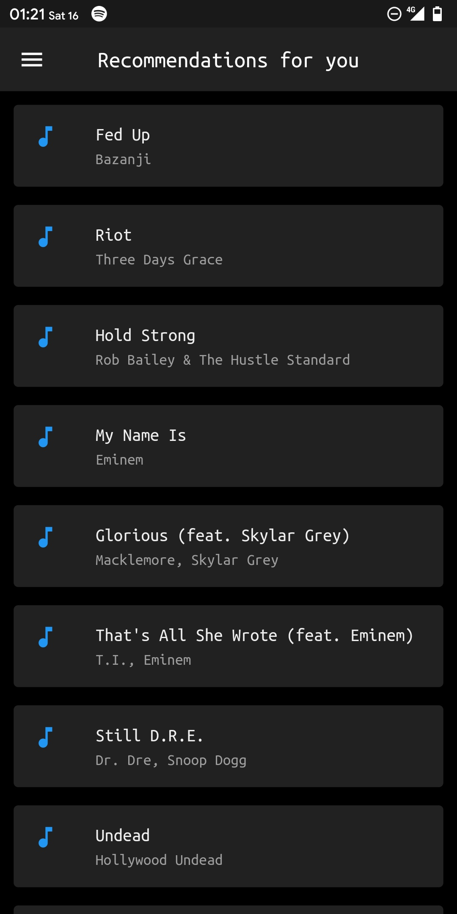
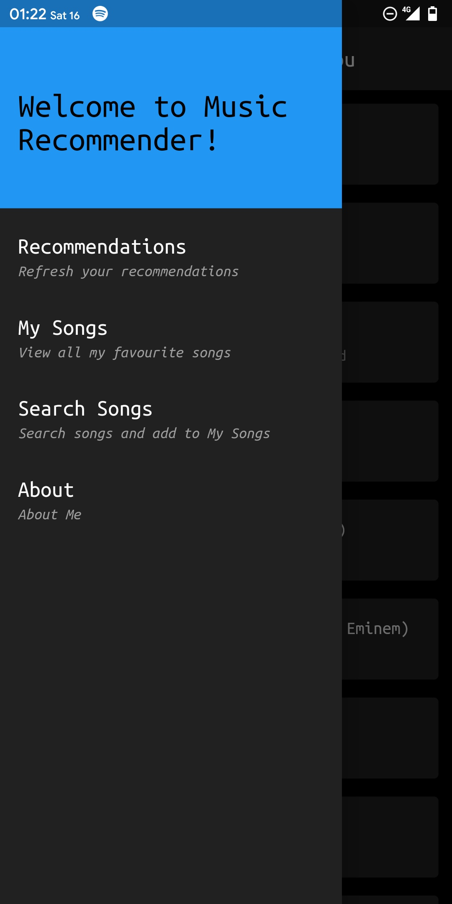
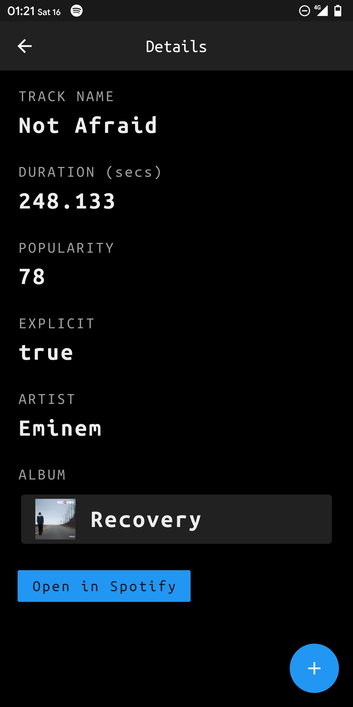

# Recommelody

A flutter app, that recommends music based on user favourites, using the Spotify Web API.

## Download APK

Download the fat APK [here](https://github.com/Gautam-J/music_recommender/releases/download/v1.0/recommelody.apk).

## Screenshots

### Loading Screen

### Recommendations

### Sidebar

### Detailed View

